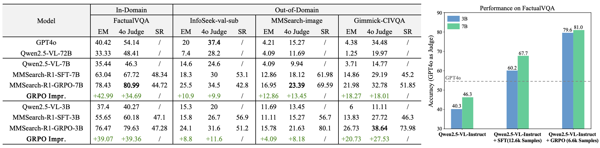

# Multimodal-Search-R1: Incentivizing LMMs to Search

We introduce **MMSearch-R1**, an initial effort to equip LMMs with active image search capabilities through an end-to-end RL framework. Our goal is to train models not only to determine when to invoke the image search tool but also to effectively extract, synthesize, and utilize relevant information to support downstream reasoning. This work represents a foundational step toward enabling LMMs to dynamically interact with external tools in a goal-directed manner, thereby enhancing their performance on long-tailed and knowledge-intensive VQA tasks.



## News
**[25.04.03]** We’ve released a [**blog**](https://kimingng.notion.site/MMSearch-R1-Incentivizing-LMMs-to-Search-1bcce992031880b2bc64fde13ef83e2a?pvs=4) introducing the MMSearch-R1 Project in more detail!

## Installation
### Environment Setup
```bash
cd multimodal-search-r1
# Init Conda Env
conda create -n imsearch python=3.9 -y
conda activate imsearch
# veRL
pip3 install -e .
# flash-attn
pip3 install flash-attn --no-build-isolation
# Config wandb
pip3 install wandb
export WANDB_API_KEY="XXX"
wandb login $WANDB_API_KEY
```

### Search Tool Implemention
Currently, we reference [OpenDeepResearcher](https://github.com/mshumer/OpenDeepResearcher), which uses [SerpApi](https://serpapi.com/) + [JINA Reader](https://jina.ai/reader/) + LLM summarization to return the most relevant web content related to an image. Before formal training, you need to implement your own search tool pipeline under the `tools/` directory and call it as needed during the multi-turn rollout process.

## Train & Eval
We recommend use the command below for unified training and evaluation:
```bash
bash scripts/run_imsearch_grpo.sh
```
We highlight the important configurations for training the Multi-Round Search LMMs:
- `actor_rollout_ref.rollout.name`: should be `vllm_multiturn_imsearch` for multi-turn search rollout;
- `actor_rollout_ref.actor.use_multi_turn_response_mask`: should be `True`, as we use it to refine the original `response_mask` for accurate loss calculation.
- `actor_rollout_ref.rollout.max_gen_round`: The max number of turns during rollout;
- `data.max_response_length`: The max response length for each turn;
- `actor_rollout_ref.rollout.response_length_total`: The max conversation length for all turns (except the user prompt in the first turn);

For evaluation only, configure these parameters in the above script:
```bash
...
trauner.val_files=${path_to_val_data}
+trainer.val_only=True \
trainer.val_generations_to_log_to_wandb=64 # num of val generations to log
```
After training, use `scripts/model_merger.py` to merge the sharded ckpts to huggingface format.

## Acknowledgement
We sincerely thank these repositories for providing helpful open-source resources: [Qwen2.5-VL](https://github.com/QwenLM/Qwen2.5-VL), [veRL](https://github.com/volcengine/verl), [OpenDeepResearcher](https://github.com/mshumer/OpenDeepResearcher), [cfpark00/verl](https://github.com/cfpark00/verl/tree/multi_turn_rollout), [Search-R1](https://github.com/PeterGriffinJin/Search-R1).